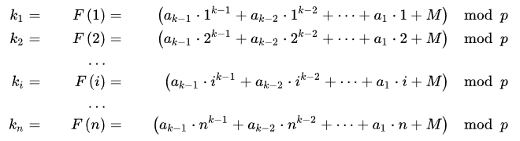
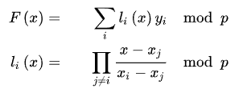
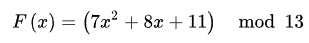
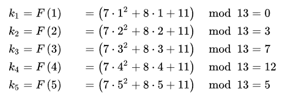
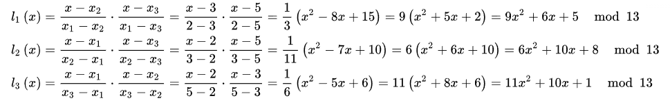
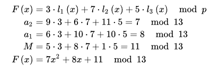

# PyQuorum

Cryptographic library for secret sharing and key management, powered by Rust

## Installation
```bash
pip install pyquorum
```

## Quick Start
```python
from pyquorum import ShamirScheme, generate_key

k=3 # threshold for combine
n=4 # number of total shares
key = generate_key()
Scheme = ShamirScheme(k, n)
shares = Scheme.split(key)
combine = Scheme.combine(shares)
```

## Security
This library does:
- generate key
- split secret
- combine secret

What it doesn't:
- replace encryption packages like cryptography, pyserpent and etc

If you found a security issue, please refer to [SECURITY.md](SECURITY.md)

## Roadmap to v1.0.0
- [x] - Shamir Scheme
- [ ] - Blakley Scheme
- [ ] - Additive Scheme
- [ ] - HKDF Key Derivation
- [ ] - Threshold ECDSA

## Support
If you find this package usefull, you can star repo on github

## Theory

### Shamir Scheme Share

How to split a secret key



How to combine a secret key



### Example







