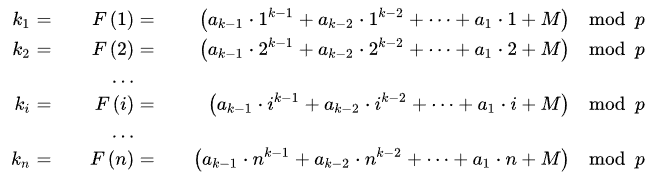
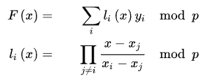
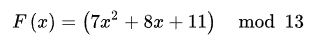
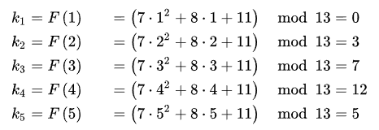
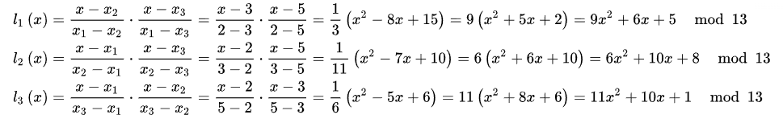
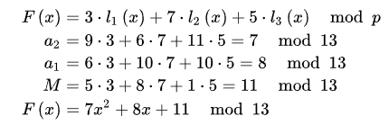
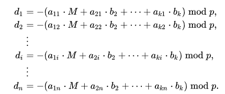
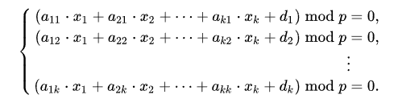
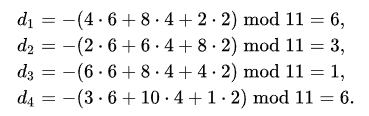
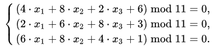

# PyQuorum

Cryptographic library for secret sharing and key management, powered by Rust

## Installation
```bash
pip install pyquorum
```

## Quick Start
```python
from pyquorum import ShamirScheme, BlakleyScheme, AdditiveScheme, Shares, generate_key, hkdf

k = 3  # threshold for combine
n = 5  # number of total shares
key = generate_key()  # 32-byte secret

# Shamir and Blakley are threshold schemes: any k of the n shares restore the key
scheme = ShamirScheme(k, n)  # or BlakleyScheme(k, n)
shares = scheme.split(key)
assert scheme.combine(shares) == key

# Additive is n-of-n: every single share is required
additive = AdditiveScheme(n)
additive_shares = additive.split(key)
assert additive.combine(additive_shares) == key

# Derive subkeys from the secret with HKDF (RFC 5869, HMAC-SHA256)
subkey = hkdf(key, 32, salt=b"session", info=b"encryption")

# Shares can be serialized; the index stays the dictionary key
restored = Shares.from_json(shares.to_json())
assert scheme.combine(restored) == key
```

## Security
This library does:
- generate key
- split secret
- combine secret

What it doesn't:
- replace encryption packages like cryptography, pyserpent and etc

> **WARNING** - This library is in active development (0.x.x). 
> It has not undergone a professional security audit and contains 
> known vulnerabilities. **Do not use in production.**

You can review known vulnerabilities in [SECURITY_ISSUES_TRACKER.md](SECURITY_ISSUES_TRACKER.md)

If you found a security issue, please refer to [SECURITY.md](SECURITY.md)

## Roadmap to v1.0.0
- [x] - Shamir Scheme
- [x] - Blakley Scheme
- [x] - Additive Scheme
- [x] - HKDF Key Derivation
- [ ] - Threshold ECDSA

## Support
If you find this package usefull, you can star repo on github

## Theory

### Shamir Scheme Share

How to split a secret key



How to combine a secret key



### Example









### Blakley Scheme Share

How to split a secret key



How to combine a secret key



### Example





### Additive Scheme Share

Every share is a uniformly random byte string of the same length as the secret,
and the last share is the xor of the secret with all the others. The scheme is
therefore n-of-n: any n-1 shares are independent of the secret, and all n are
required to restore it. Shares are combined with xor in GF(2^256), so the split
is exact and needs no modular arithmetic.

```python
scheme = AdditiveScheme(3)
shares = scheme.split(key)   # "1:<hex>", "2:<hex>", "3:<hex>"
assert scheme.combine(shares) == key
```

### HKDF Key Derivation

`hkdf(ikm, length, salt=b"", info=b"")` implements HKDF (RFC 5869) with
HMAC-SHA256 and matches the RFC SHA-256 test vectors. `length` is the number of
output bytes and must be in `1..255*32`; a missing or empty `salt` means the
RFC default of HashLen zero bytes.

```python
subkey = hkdf(key, 64, salt=b"session-1", info=b"aes-key")
```